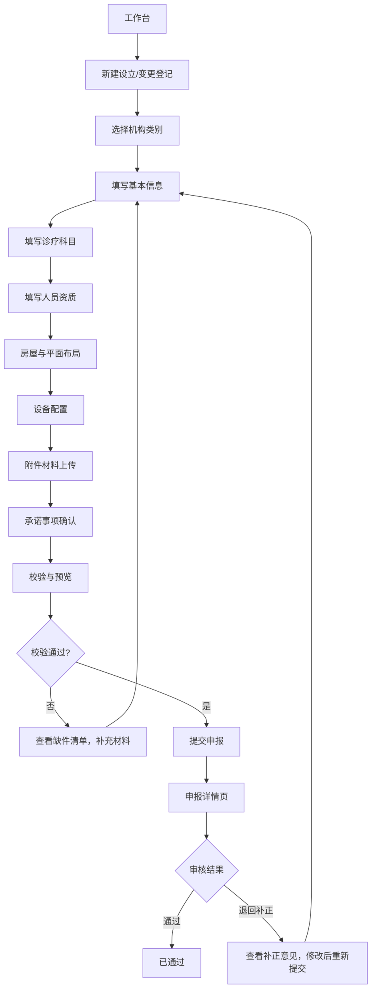

## 1. 产品概述

医疗机构执业登记申报系统是一款面向医疗机构办证专员的 Web 申报工具，旨在将执业登记前的材料校验和正式申报整合成一条清晰的流程化通道。系统聚焦门诊部、诊所、护理站等机构，通过智能化的表单校验、材料清单管理和申报状态跟踪，减少反复申报时的漏填漏传问题，提升办证效率。

- **目标用户：医疗机构办证专员、行政人员

- **核心价值**：将材料智能校验、缺件自动生成、申报流程标准化、历史版本可追溯

## 2. 核心功能

### 2.1 用户角色

| 角色 | 登录方式 | 核心权限 |
|------|----------|----------|
| 办证专员 | 账号登录 | 创建申报、填写资料、上传附件、提交审核、查看历史、打印申报表 |

### 2.2 功能模块

1. **工作台**：申报概览、快捷操作入口、申报统计
2. **申报列表**：申报记录、状态筛选、搜索
3. **申报向导**：分步式表单填写、实时校验
4. **校验与预览**：材料校验、缺件清单、申报表预览
5. **申报详情**：详情查看、补正意见、版本历史

### 2.3 页面详情

| 页面名称 | 模块名称 | 功能描述 |
|---------|----------|----------|
| 工作台 | 数据概览 | 申报总数、待提交、审核中、已通过统计卡片 |
| 工作台 | 快捷入口 | 新建设立登记、新建变更登记快捷按钮 |
| 工作台 | 最近申报 | 最近5条申报记录列表 |
| 申报列表 | 筛选区 | 按状态、类型、时间范围筛选 |
| 申报列表 | 列表区 | 申报记录表格、状态标签、操作按钮 |
| 申报向导 | 步骤导航 | 7个步骤：基本信息、诊疗科目、人员资质、房屋布局、设备配置、附件材料、承诺事项 |
| 申报向导 | 机构类别选择 | 门诊部/诊所/护理站等机构类别选择，自动匹配必填项 |
| 申报向导 | 实时校验 | 名称规范校验、地址校验、人员证照校验、科目匹配校验 |
| 校验与预览 | 校验结果 | 校验通过/不通过项列表 |
| 校验与预览 | 缺件清单 | 自动生成缺失材料清单 |
| 校验与预览 | 申报表预览 | 可打印的正式申报表 |
| 申报详情 | 基本信息 | 申报基础信息展示 |
| 申报详情 | 补正意见 | 审核意见历史记录 |
| 申报详情 | 版本对比 | 历次提交版本对比 |

## 3. 核心流程

用户登录系统后，在工作台或申报列表页选择新建设立登记或变更登记，进入申报向导页面。系统会先选择机构类别，然后按7个步骤依次填写资料，每一步都有实时校验。填写完成后进入校验与预览页，系统自动校验所有材料并生成缺件清单。确认无误后提交申报，可在申报详情页查看审核状态、补正意见和历史版本。

## 4. 用户界面设计

### 4.1 设计风格

- **主色调**：医疗蓝（#1E6FD9），传达专业、可信赖的医疗行业属性
- **辅助色**：成功绿（#10B981）表示通过、警告橙（#F59E0B）表示待补充、错误红（#EF4444）表示错误
- **中性色**：深灰（#1F2937）、中灰（#6B7280）、浅灰（#F3F4F6）
- **按钮风格**：圆角按钮，主按钮为实色填充，悬停有轻微阴影和过渡动画
- **字体**：系统字体栈，中文使用 PingFang SC / Microsoft YaHei，数字和英文使用 Segoe UI / Roboto
- **布局风格**：卡片式布局，左侧导航 + 内容区双栏结构
- **图标风格**：线性图标（lucide-react）
- **整体风格**：专业、简洁、高效的政务/医疗专业风格，注重信息层级清晰，操作流程明确

### 4.2 页面设计概览

| 页面名称 | 模块名称 | UI元素 |
|---------|----------|--------|
| 工作台 | 数据概览卡片 | 四个统计卡片，图标+数字+标签，渐变背景 |
| 工作台 | 快捷操作区 | 两个大号操作按钮，带图标和描述文字 |
| 工作台 | 最近申报列表 | 表格展示，状态标签色区分 |
| 申报列表 | 顶部筛选栏 | 搜索框、状态筛选下拉、时间筛选 |
| 申报列表 | 数据表格 | 斑马纹表格，操作列有查看/编辑/删除操作 |
| 申报向导 | 步骤指示器 | 顶部横向步骤条，当前步骤高亮 |
| 申报向导 | 表单区域 | 分组表单，分组表单分组表单分组，必填项标红星 |
| 申报向导 | 底部操作栏 | 上一步/下一步按钮，保存草稿 |
| 校验与预览 | 校验结果面板 | 分组展示通过/警告/错误三类 |
| 校验与预览 | 缺件清单 | 列表展示，可跳转补全 |
| 校验与预览 | 申报表预览 | 模拟打印纸张效果 |
| 申报详情 | 信息卡片 | 分组展示各类信息 |
| 申报详情 | 时间线 | 申报进度时间线 |
| 申报详情 | 版本选择器 | 版本切换下拉 |

### 4.3 响应式设计

- **桌面优先设计，主内容区最小宽度 1200px
- 中等屏幕（1024px 以下）：侧边栏收起为图标导航
- 平板及以下：顶部导航栏，内容区全宽

### 4.4 动效与交互

- 步骤切换有平滑过渡动画
- 表单校验错误时有抖动提示
- 按钮悬停有阴影加深效果
- 页面加载有骨架屏占位
- 表格行悬停高亮
