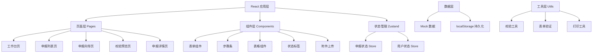
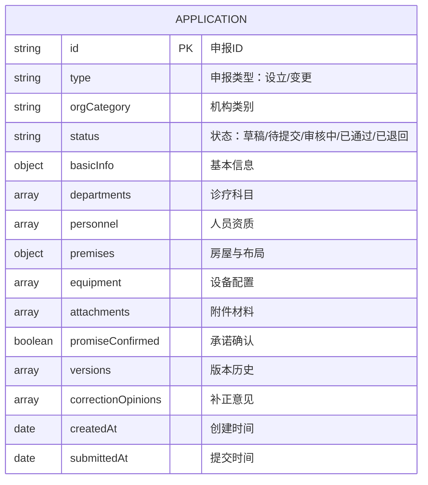

## 1. 架构设计

本系统采用纯前端架构，使用 React + TypeScript + Vite 构建，所有数据使用本地 mock 数据和 localStorage 持久化存储。



## 2. 技术选型

- **前端框架**：React@18 + TypeScript
- **构建工具**：Vite@5
- **样式方案**：Tailwind CSS@3
- **状态管理**：Zustand
- **路由管理**：React Router DOM@6
- **图标库**：lucide-react
- **数据持久化**：localStorage
- **数据模拟：Mock 数据（内置模拟数据

## 3. 路由定义

| 路由路径 | 页面名称 | 说明 |
|----------|----------|------|
| /dashboard | 工作台 | 首页，数据概览与快捷入口 |
| /applications | 申报列表 | 所有申报记录列表 |
| /applications/new | 新建申报 | 选择申报类型和机构类别 |
| /applications/:id/wizard | 申报向导 | 分步填写申报资料 |
| /applications/:id/preview | 校验预览 | 材料校验与申报表预览 |
| /applications/:id/detail | 申报详情 | 申报详情与历史版本 |

## 4. 数据模型

### 4.1 数据模型定义



### 4.2 核心数据结构

#### 申报基本信息 (ApplicationBasicInfo
- 机构名称、机构类别、经营性质、法定代表人、主要负责人、执业地址、联系电话、注册资金等

#### 诊疗科目 (Department)
- 科目代码、科目名称、级别、备注

#### 人员资质 (Personnel)
- 姓名、性别、身份证号、职务、职称、执业证书号、证书有效期、执业范围

#### 房屋与布局 (Premises)
- 建筑面积、使用面积、房屋性质、产权证明、平面布局图

#### 设备配置 (Equipment)
- 设备名称、型号、数量、生产厂家、购置日期

#### 附件材料 (Attachment)
- 附件分类、文件名、文件大小、上传时间、文件状态

### 4.3 校验规则

#### 机构类别 必填项
- 门诊部：基本信息、诊疗科目、人员资质（医师≥3人、护士≥5人）、房屋布局、设备配置
- 诊所：基本信息、诊疗科目、人员资质（医师≥1人、护士≥1人）、房屋布局
- 护理站：基本信息、人员资质（护士≥2人）、房屋布局、设备配置

## 5. 项目结构

```
src/
├── components/          # 通用组件
│   ├── Layout/         # 布局组件
│   │   ├── Sidebar.tsx
│   │   └── Header.tsx
│   ├── Form/         # 表单组件
│   │   ├── FormInput.tsx
│   │   ├── FormSelect.tsx
│   │   └── FormDatePicker.tsx
│   ├── Steps/        # 步骤条
│   ├── StatusBadge.tsx
│   ├── DataTable.tsx
│   └── FileUpload.tsx
├── pages/             # 页面组件
│   ├── Dashboard.tsx
│   ├── ApplicationList.tsx
│   ├── ApplicationWizard/
│   │   ├── index.tsx
│   │   ├── StepBasicInfo.tsx
│   │   ├── StepDepartments.tsx
│   │   ├── StepPersonnel.tsx
│   │   ├── StepPremises.tsx
│   │   ├── StepEquipment.tsx
│   │   ├── StepAttachments.tsx
│   │   └── StepPromise.tsx
│   ├── Preview.tsx
│   └── Detail.tsx
├── store/             # 状态管理
│   └── applicationStore.ts
├── utils/             # 工具函数
│   ├── validator.ts
│   ├── mockData.ts
│   └── helpers.ts
├── types/             # 类型定义
│   └── index.ts
├── App.tsx
├── main.tsx
└── index.css
```

## 6. 校验逻辑

### 6.1 实时校验规则

1. **机构名称校验**
   - 长度校验：长度限制
   - 规范校验：含地区+字号+行业+组织形式
   - 敏感词过滤

2. **执业地址校验**
   - 格式规范性校验
   - 行政区划匹配

3. **人员证照校验**
   - 身份证号格式校验
   - 执业证书号格式校验
   - 证书有效期校验
   - 执业范围与诊疗科目匹配

4. **诊疗科目与人员设备匹配校验**
   - 每个科目至少有1名对应专业医师
   - 必备设备是否齐全

5. **附件材料完整性校验**
   - 按机构类别列出必填附件
   - 文件格式与大小校验
